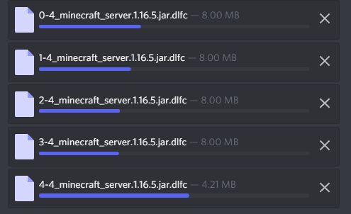
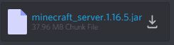

# Split Large Files
Split large files is a BetterDiscord plugin that makes sending large files easy by breaking up big files into smaller ones that get reassembled upon download. With the current version's protocol, a theoretical max file size of around 2 GB for normal users or around 25 GB for Nitro users is possible!

If you are unable to install BetterDiscord or Split Large Files and you want to reassemble a set of chunk files someone sent you, go [here](https://imthesquid.github.io/).

## Main Features
Automatic file splitting when uploading files larger than the upload limit...

That gets visually reassembled once uploading is complete.

Downloading the file results in the reassembled original file being put in the directory of your choice.

## Other Features
- Automatically open file manager once download is complete
- Manual refresh controls both per-message and per-channel in context menus
- Automatic full-file deletion for your own chunk files that doesn't spam Discord's API

## Installation
### Github
1. Download the `SplitLargeFiles.plugin.js` file
2. Drag it into your BetterDiscord plugins directory